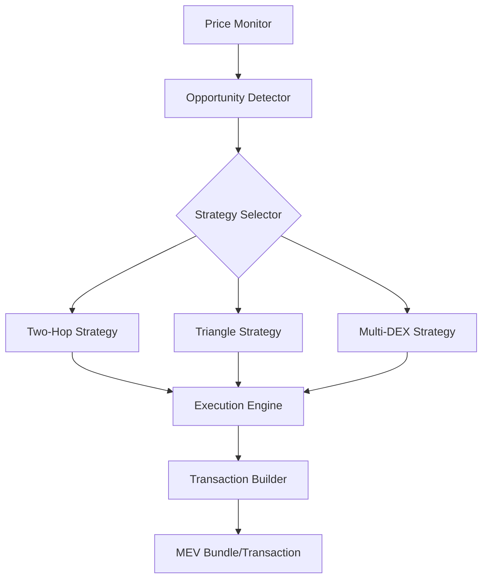
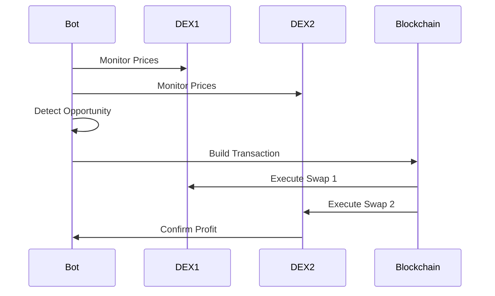

# ✨[📞💻](https://t.me/blockchainDeveloper_Ben)

# Solana Arbitrage Bot Architecture

## On-Chain Arbitrage Limitations

Important note: On-chain arbitrage programs face several limitations and risks:

1. **MEV Competition**
   - Searchers and validators can front-run transactions
   - Transaction ordering can be manipulated
   - Limited control over execution timing

2. **Technical Constraints**
   - Compute unit limitations for complex calculations
   - Transaction size limits for multi-hop trades
   - Higher latency compared to off-chain solutions

3. **Recommended Approach**
   - Use off-chain arbitrage detection
   - Submit transactions through MEV-aware RPC providers
   - Consider integrating with Jito-MEV for better execution

4. **Alternative Architecture**
   ```mermaid
   graph TD
       A[Off-chain Monitor] --> B[Price Analysis]
       B --> C[Opportunity Detection]
       C --> D[Transaction Builder]
       D --> E[MEV-aware RPC]
       E --> F[Validator Network]
   ```

The original implementation should be considered as educational material rather than a production-ready solution. For real-world arbitrage:

- Use off-chain monitoring and calculations
- Integrate with MEV-aware infrastructure
- Consider validator relationships for better transaction placement
- Implement proper slippage and risk management

## Overview

This arbitrage bot implements advanced strategies for detecting and executing profitable trading opportunities across multiple Solana DEXs including Raydium, Orca (Whirlpool), Meteora, and Jupiter, with optional integration for Jito-MEV. Visulize about logic and architecture diagram.
I newly added solana-program  in 2025 for developer who give me stars on github. It can be useful who are going to implement arbitrage bot on solana blockchain. I hope it will be useful for you. If you have any question, please let me know. I will be happy to help you.



## Core Components

### 1. Price Monitoring System
- Real-time price monitoring across DEXs
- WebSocket connections for instant updates
- Price impact calculation
- Liquidity depth analysis

### 2. Strategy Types

#### A. Two-Hop Arbitrage
Example from Transaction Analysis:
```
Input: 0.196969275 Token A
↓ [Meteora DEX]
Intermediate: 146.90979292 Token B
↓ [Raydium DEX]
Output: 0.202451396 Token A
Profit: ~2.78%
```

#### B. Triangle Arbitrage
Example Pattern:
```
Token A → Token B [Meteora]
Token B → Token C [Meteora]
Token C → Token A [Raydium]
```

#### C. Multi-DEX Arbitrage
Example from Whirlpool-Orca Route:
```
Input: 0.314737179 Token A
↓ [Orca]
Mid: 118.612731091 Token B
↓ [Whirlpool]
Output: 0.316606012 Token A
Profit: ~0.59%
```

### 3. Execution Methods

#### Priority Queue:
1. Profitability Check
   - Minimum profit threshold: 0.5%
   - Gas cost estimation
   - Slippage calculation

2. Route Optimization
   - DEX selection based on:
     * Liquidity depth
     * Historical success rate
     * Gas efficiency

3. Transaction Building
   ```typescript
   // Example structure
   const route = {
     steps: [
       {dex: "Meteora", tokenIn: "A", tokenOut: "B"},
       {dex: "Raydium", tokenIn: "B", tokenOut: "A"}
     ],
     expectedProfit: "2.78%",
     gasEstimate: 200000
   };
   ```

## Risk Management

### 1. Slippage Protection
- Dynamic slippage calculation
- Maximum slippage: 1%
- Route abandonment on excessive slippage

### 2. Transaction Monitoring
- Success rate tracking
- Gas price optimization
- Failed transaction analysis

### 3. Position Sizing
- Dynamic position sizing based on:
  * Available liquidity
  * Historical volatility
  * Success probability

## Performance Metrics

### Target Metrics:
- Minimum profit per trade: 0.5%
- Maximum gas cost: 0.002741081 SOL
- Transaction success rate: >95%

## Implementation Guidelines

### 1. DEX Integration Priority
1. Meteora: Primary DEX for initial swaps
2. Raydium: Secondary DEX for route completion
3. Orca Whirlpool: Specialized for concentrated liquidity
4. Jupiter: Aggregation and backup routes

### 2. Transaction Flow


### 3. Error Handling
- Retry mechanism for failed transactions
- Fallback routes on primary route failure
- Automatic circuit breaker on consecutive failures

## Configuration

```javascript
const config = {
  minProfitThreshold: 0.005, // 0.5%
  maxSlippage: 0.01, // 1%
  gasLimit: 900000,
  dexPriority: ['meteora', 'raydium', 'orca-whirlpool', 'jupiter'],
  monitoringInterval: 1000, // 1 second
  retryAttempts: 3
};
```

## Best Practices

1. Always maintain sufficient balance for gas fees
2. Implement proper error handling and logging
3. Regular monitoring of DEX contract updates
4. Maintain fallback routes for each strategy
5. Regular performance analysis and strategy adjustment

## Rust Implementation Details

### On-Chain Program Structure

```rust
// Program entrypoint and state management
#[program]
pub mod solana_arbitrage {
    use super::*;
    
    #[state]
    pub struct ArbitrageState {
        pub owner: Pubkey,
        pub profit_threshold: u64,
        pub active_routes: u64,
    }

    // Initialize the arbitrage program
    #[access_control(Initialize::accounts(&ctx))]
    pub fn initialize(ctx: Context<Initialize>) -> Result<()> {
        // Implementation
    }

    // Execute arbitrage route
    pub fn execute_arbitrage(ctx: Context<ExecuteArbitrage>, route_data: RouteData) -> Result<()> {
        // Implementation
    }
}

// Account validation structures
#[derive(Accounts)]
pub struct ExecuteArbitrage<'info> {
    #[account(mut)]
    pub user: Signer<'info>,
    #[account(mut)]
    pub user_token_account_a: Account<'info, TokenAccount>,
    #[account(mut)]
    pub user_token_account_b: Account<'info, TokenAccount>,
    pub token_program: Program<'info, Token>,
    // DEX program accounts
    pub raydium_program: Program<'info, Raydium>,
    pub orca_program: Program<'info, Orca>,
    pub meteora_program: Program<'info, Meteora>,
}
```

### Cross-Program Invocation (CPI) Integration

```rust
// DEX integration modules
pub mod dex {
    pub mod meteora {
        use anchor_lang::prelude::*;
        
        pub fn swap(
            ctx: Context<MeteoraSwap>,
            amount_in: u64,
            minimum_amount_out: u64
        ) -> Result<()> {
            // Implementation
        }
    }
    
    pub mod raydium {
        use anchor_lang::prelude::*;
        
        pub fn swap(
            ctx: Context<RaydiumSwap>,
            amount_in: u64,
            minimum_amount_out: u64
        ) -> Result<()> {
            // Implementation
        }
    }
    
    pub mod orca {
        use anchor_lang::prelude::*;
        
        pub fn whirlpool_swap(
            ctx: Context<OrcaSwap>,
            amount_in: u64,
            sqrt_price_limit: u128
        ) -> Result<()> {
            // Implementation
        }
    }
}
```

### Off-Chain Client Implementation

```rust
use anchor_client::solana_sdk::{
    commitment_config::CommitmentConfig,
    signature::{Keypair, Signer},
    transaction::Transaction,
};

pub struct ArbitrageClient {
    cluster: Cluster,
    wallet: Keypair,
    commitment: CommitmentConfig,
}

impl ArbitrageClient {
    // Monitor price feeds across DEXs
    pub async fn monitor_prices(&self) -> Result<Vec<PriceData>> {
        // Implementation using websocket connections
    }

    // Calculate optimal arbitrage route
    pub fn calculate_route(&self, prices: Vec<PriceData>) -> Option<RouteData> {
        // Implementation
    }

    // Execute arbitrage transaction
    pub async fn execute_route(&self, route: RouteData) -> Result<Signature> {
        // Implementation
    }
}

// Price monitoring implementation
#[derive(Debug)]
pub struct PriceMonitor {
    websocket_clients: Vec<WebSocketClient>,
    price_cache: Arc<RwLock<HashMap<String, PriceData>>>,
}

impl PriceMonitor {
    pub async fn start_monitoring(&self) -> Result<()> {
        // Implementation
    }

    pub fn get_latest_prices(&self) -> HashMap<String, PriceData> {
        // Implementation
    }
}
```

### Error Handling and Custom Types

```rust
#[error_code]
pub enum ArbitrageError {
    #[msg("Insufficient profit margin")]
    InsufficientProfit,
    #[msg("Slippage tolerance exceeded")]
    SlippageExceeded,
    #[msg("Invalid route configuration")]
    InvalidRoute,
    #[msg("Insufficient liquidity")]
    InsufficientLiquidity,
}

#[derive(AnchorSerialize, AnchorDeserialize, Clone, Debug)]
pub struct RouteData {
    pub steps: Vec<SwapStep>,
    pub min_profit_lamports: u64,
    pub deadline: i64,
}

#[derive(AnchorSerialize, AnchorDeserialize, Clone, Debug)]
pub struct SwapStep {
    pub dex_program_id: Pubkey,
    pub pool_id: Pubkey,
    pub token_in: Pubkey,
    pub token_out: Pubkey,
    pub amount_in: u64,
    pub minimum_amount_out: u64,
}
```

### Configuration and Constants

```rust
pub mod constants {
    use solana_program::declare_id;

    // Program IDs
    declare_id!("ArbitrageProgram11111111111111111111111111111111");
    
    // DEX Program IDs
    pub const RAYDIUM_PROGRAM_ID: &str = "675kPX9MHTjS2zt1qfr1NYHuzeLXfQM9H24wFSUt1Mp8";
    pub const ORCA_WHIRLPOOL_PROGRAM_ID: &str = "whirLbMiicVdio4qvUfM5KAg6Ct8VwpYzGff3uctyCc";
    pub const METEORA_PROGRAM_ID: &str = "M2mx93ekt1fmXSVkTrUL9xVFHkmME8HTUi5Cyc5aF7K";
    
    // Configuration Constants
    pub const MIN_PROFIT_THRESHOLD: u64 = 5000; // 0.5% in bps
    pub const MAX_SLIPPAGE: u64 = 10000;        // 1% in bps
    pub const MAX_COMPUTE_UNITS: u32 = 900_000;
    pub const PRIORITY_FEES: u64 = 1_000;       // lamports
}
```

### Build and Test Instructions

```bash
# Build the program
cargo build-bpf

# Run tests
cargo test-bpf

# Deploy
solana program deploy target/deploy/solana_arbitrage.so
```

### Testing Framework

```rust
#[cfg(test)]
mod tests {
    use super::*;
    use solana_program_test::*;
    
    #[tokio::test]
    async fn test_arbitrage_execution() {
        // Test implementation
    }
    
    #[tokio::test]
    async fn test_slippage_protection() {
        // Test implementation
    }
    
    #[tokio::test]
    async fn test_profit_calculation() {
        // Test implementation
    }
}
```

## Security Considerations

1. **Transaction Atomicity**
   ```rust
   // Ensure all swaps in the route are atomic
   #[invariant(check_atomic_execution)]
   pub fn execute_route(ctx: Context<ExecuteRoute>, route: RouteData) -> Result<()> {
       // Implementation with require! macro for validation
   }
   ```

2. **Slippage Protection**
   ```rust
   // Implement slippage checks
   pub fn check_slippage(
       amount_expected: u64,
       amount_received: u64,
       max_slippage_bps: u64
   ) -> Result<()> {
       // Implementation
   }
   ```

3. **Deadline Validation**
   ```rust
   // Validate transaction deadline
   pub fn validate_deadline(deadline: i64) -> Result<()> {
       require!(
           Clock::get()?.unix_timestamp <= deadline,
           ArbitrageError::DeadlineExceeded
       );
       Ok(())
   }
   ```


## install for test

```
npm install @project-serum/anchor @solana/web3.js @solana/spl-token chai

```


# reference 

https://www.rapidinnovation.io/post/solana-trading-bot-development-in-2024-a-comprehensive-guide
 https://station.jup.ag/docs/projects-and-dexes/integration-guidelines
 https://docs.raydium.io/raydium/protocol/developers/addresses

 https://orca-so.gitbook.io/orca-developer-portal/whirlpools/interacting-with-the-protocol/orca-whirlpools-parameters

 https://github.com/raydium-io/raydium-amm/blob/master/program/Cargo.toml

 https://github.com/raydium-io/raydium-cpi-example

 https://github.com/raydium-io/raydium-docs/tree/master/dev-resources

 https://github.com/microgift/meteora-cpi

 https://github.com/orca-so/whirlpool-cpi-sample/blob/main/anchor-0.29.0/programs/whirlpool-cpi-sample/
 
 https://github.com/MeteoraAg/cpi-examples

<div style="background-color: #f5f5f5; padding: 10px; border-radius: 5px;">

| **Category**           | **Bot Name**                                          | **Description**                              | **Repo Link**                                                                 |
|-------------------------|-------------------------------------------------------|----------------------------------------------|------------------------------------------------------------------------------|
| **Volume Bots**         | Ethereum Volume Bot (Single Wallet)                  | EVM-based volume bot with single wallet      | [Repo](https://github.com/Kelvin-1013/Ether-Volume-Bot-v1)                  |
|                         | Ethereum Volume Bot (Multiple Wallets)              | EVM-based bot using multiple wallets         | [Repo](https://github.com/Kelvin-1013/Ether-Volume-Bot-v2)                  |
|                         | Base Volume Bot                                      | EVM volume bot for Base ecosystem            | [Repo](https://github.com/Kelvin-1013/base-volume-bot)                        |
|                         | Raydium Volume Bot v1                                | Solana-based AMMDEX volume bot               | [Repo](https://github.com/Kelvin-1013/RaydiumVolumeBot-v1)                  |
|                         | Raydium Volume Bot v2                                | Jupiter + Raydium SDK for market making      | [Repo](https://github.com/Kelvin-1013/RaydiumVolumeBot-v2)                  |
|                         | Raydium Volume Bot v3                                | Jito bundle-based fast bot                   | [Repo](https://github.com/Kelvin-1013/RaydiumVolumeBot-v3)                  |
|                         | Solana Multidex Volume Bot                           | Volume bot for Raydium, Meteora, and Jupiter | [Repo](https://github.com/Kelvin-1013/Solana-MultiDex-Volume-Bot)           |
|                         | Meteora Volume Bot                                   | Solana-specific Meteora volume bot           | [Repo](https://github.com/Kelvin-1013/Meteora-Volume-Bot)                   |
|                         | Pumpfun Volume Bot                                   | Solana-based volume bot                      | [Repo](https://github.com/Kelvin-1013/PumpFun-Volume-Bot)                   |
|                         | Moonshot Volume Bot                                  | High-potential Solana volume bot             | [Repo](https://github.com/Kelvin-1013/Moonshot-Volume-Bot)                  |
|                         | Tron Volume Bot                                      | Tron-based volume bot                        | [Repo](https://github.com/Kelvin-1013/Tron-Volume-Bot)                      |
|                         | Telegram Raydium Volume Bot v1                       | Volume bot with Telegram support             | [Repo](https://github.com/Kelvin-1013/Tg-Raydium-Volume-Booster-v1)         |
|                         | Telegram Raydium Volume Bot v2                       | Enhanced Telegram Raydium bot                | [Repo](https://github.com/Kelvin-1013/Tg-Raydium-Volume-Booster-v2)         |
|                         | Telegram Raydium Volume Bot v3                       | Advanced Telegram bot                        | [Repo](https://github.com/Kelvin-1013/Tg-Solana-Volume-Booster-v3)          |
| **Sniper Bots**         | Pumpfun Sniper Bot                                   | Basic sniper bot                             | [Repo](https://github.com/Kelvin-1013/PumpFun-Sniper-Bot)                   |
|                         | Pumpfun Sniper Bot v1                                | Geyser-enhanced WebSocket sniper bot         | [Repo](https://github.com/Kelvin-1013/PumpFun-Sniper-Bot-v1)                |
|                         | Pumpfun Sniper Bot v2                                | Advanced sniper with Yellowstone support     | [Repo](https://github.com/Kelvin-1013/PumpFun-Sniper-Bot-v2)                |
|                         | Raydium Sniper Bot                                   | Solana sniper bot using logs                 | [Repo](https://github.com/Kelvin-1013/Tg-Raydium-Sniper-Bot)                |
|                         | Raydium Sniper Bot v1                                | Enhanced sniper bot with WebSocket           | [Repo](https://github.com/Kelvin-1013-1013/Raydium-Sniper-Bot-v1)                |
| **Bundlers**            | Pumpfun Bundler                                      | Multi-wallet bundler                         | [Repo](https://github.com/Kelvin-1013/PumpFun-Bundler)                      |
|                         | Raydium Bundler                                      | 21+ wallet bundler for Raydium               | [Repo](https://github.com/Kelvin-1013/Raydium-Bundler)                      |
| **PumpFun Comment Bot** | PumpFun Comment Bot                                  | Automates comments for PumpFun               | [Repo](https://github.com/Kelvin-1013/PumpFun-Comment-Bot)                  |
| **Arbitrage Bots**     | Arbitrage Bot (Jupiter v6)                           | Arbitrage bot with Jupiter v6                | [Repo](https://github.com/Kelvin-1013/Arbitrage-Jupter-v6-Bot)              |
| **MemeToken Launchpad** | MemeToken Launchpad                                  | Meme token launchpad on Raydium              | [Repo](https://github.com/Kelvin-1013/Memetoken-Launcher)                   |
| **Token Freezer**       | Token Freezer                                        | Tool for freezing tokens                     | [Repo](https://github.com/Kelvin-1013/Token-Freezer)                        |
| **Copy Trading Bot**    | Copy Trading Bot                                     | Automates trades by mirroring wallets        | [Repo](https://github.com/Kelvin-1013/Copy-Trading-Bot)                     |
| **Wallet Trackers**     | Wallet Trackers                                      | Track and monitor crypto wallets             | [Repo](https://github.com/Kelvin-1013/wallet-trackers)                        |

</div>

 https://solscan.io/account/benRLpb...WGbEUm
 
