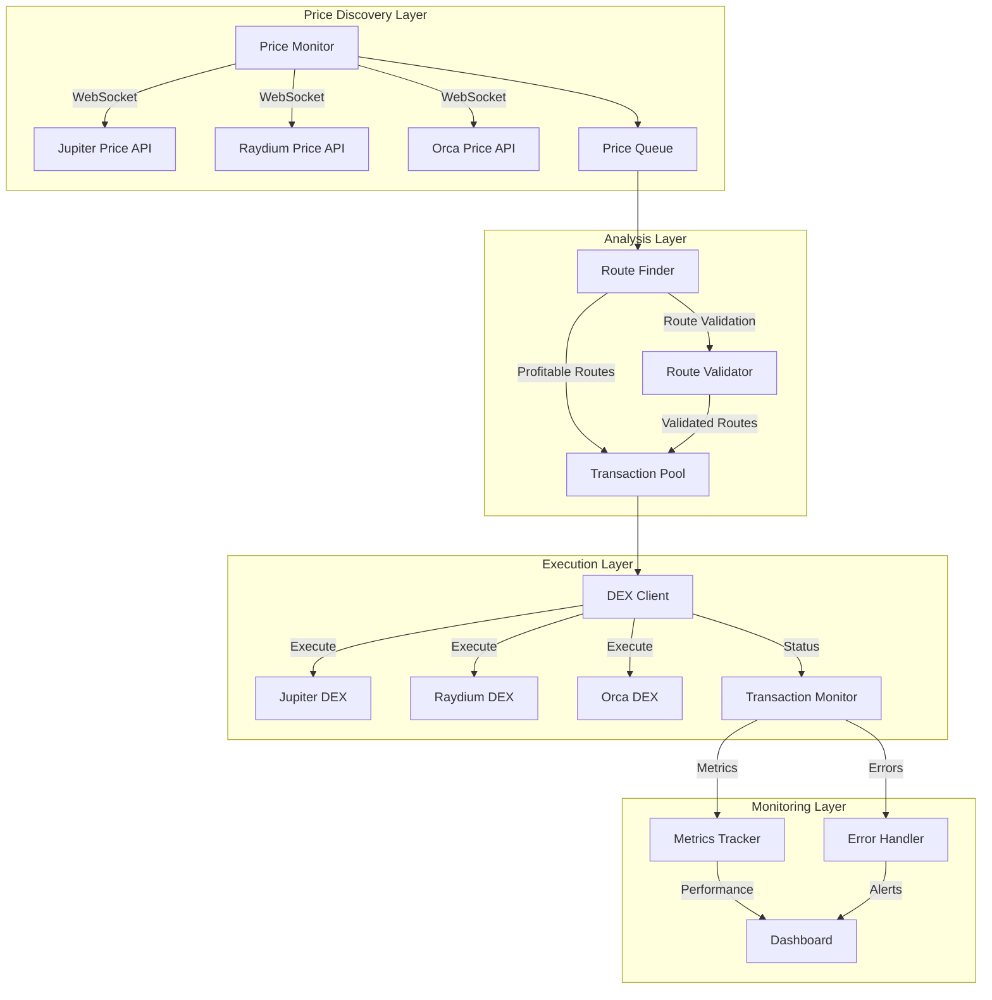
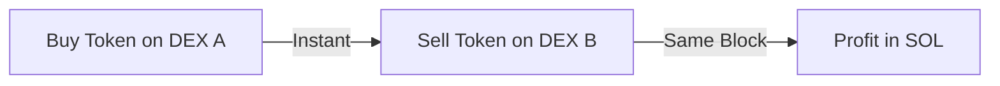
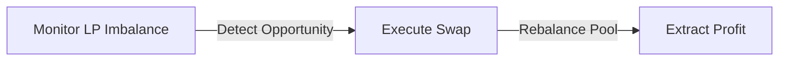
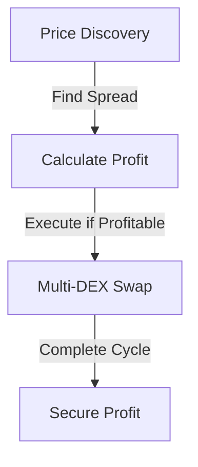

# Solana Arbitrage Bot

A high-performance, production-ready arbitrage bot built for the Solana blockchain that monitors and executes profitable trading opportunities across multiple DEXs.

## Overview

This arbitrage bot leverages Solana's high-performance blockchain to execute profitable trades by monitoring price differences between various Decentralized Exchanges (DEXs). The bot utilizes advanced algorithms for price discovery, route optimization, and transaction execution.

## System Architecture



## Core Components

### 1. Price Monitor (`price_monitor.rs`)
- **Real-time Price Tracking**
  - WebSocket connections to multiple DEX APIs
  - Price update frequency: 100ms
  - Maintains order book depth
  - Tracks price movement patterns

- **Market Analysis**
  - Volume-weighted average price (VWAP) calculation
  - Price impact estimation
  - Liquidity depth analysis
  - Historical price tracking

### 2. Route Finder (`router_finder.rs`)
- **Path Discovery**
  ```rust
  struct Route {
      path: Vec<TokenPair>,
      expected_profit: f64,
      confidence_score: f64,
      execution_time_estimate: u64,
  }
  ```

- **Route Types**
  1. Direct Arbitrage
     ```
     SOL -> USDC -> SOL (via different DEXs)
     ```
  2. Triangle Arbitrage
     ```
     SOL -> USDC -> RAY -> SOL
     ```
  3. Multi-hop Arbitrage
     ```
     SOL -> USDC -> RAY -> SRM -> SOL
     ```

### 3. DEX Client (`dex_client.rs`)
- **Transaction Building**
  - Instruction composition
  - Account resolution
  - Signature management

- **DEX Integration**
  ```rust
  trait DexClient {
      async fn create_swap_transaction(&self, route: Route) -> Result<Transaction>;
      async fn execute_swap(&self, transaction: Transaction) -> Result<Signature>;
      async fn get_swap_quote(&self, token_pair: TokenPair) -> Result<Quote>;
  }
  ```

### 4. Transaction Pool (`pool.rs`)
- **Queue Management**
  - Priority-based execution
  - Concurrent transaction handling
  - Rate limiting and backoff strategies

- **Transaction States**
  ```rust
  enum TransactionState {
      Pending,
      Executing,
      Completed(Signature),
      Failed(Error),
      Timeout,
  }
  ```

## Trading Strategies

### 1. Flash Arbitrage


### 2. Liquidity Pool Arbitrage


### 3. Cross-DEX Arbitrage


## Risk Management System

### 1. Transaction Safety
- Maximum trade size limits
- Slippage protection (default: 1%)
- Transaction timeout (default: 2 blocks)
- Minimum profit threshold

### 2. Error Handling
```rust
enum ArbitrageError {
    InsufficientLiquidity(TokenPair),
    SlippageExceeded { expected: f64, actual: f64 },
    TransactionTimeout(Signature),
    NetworkError(String),
    InsufficientFunds { required: u64, available: u64 },
}
```

### 3. Circuit Breakers
- Maximum daily loss limit
- Unusual price movement detection
- Network congestion detection
- Rapid transaction failure detection

## Performance Optimization

### 1. Transaction Optimization
- Compute unit optimization
- Priority fee adjustment
- Account reuse
- Instruction compression

### 2. Memory Management
```rust
struct MemoryConfig {
    price_history_limit: usize,
    transaction_queue_size: usize,
    concurrent_requests: usize,
    websocket_buffer_size: usize,
}
```

## Monitoring and Analytics

### 1. Performance Metrics
- Profit/Loss tracking
- Success rate
- Average execution time
- Gas efficiency

### 2. Real-time Monitoring
```rust
struct MetricsCollector {
    trades_executed: Counter,
    profit_secured: Gauge,
    active_routes: Gauge,
    execution_time: Histogram,
    error_rate: Counter,
}
```

## Configuration

```toml
[network]
rpc_url = "https://api.mainnet-beta.solana.com"
ws_url = "wss://api.mainnet-beta.solana.com"

[trading]
min_profit_threshold = 0.001  # SOL
max_trade_size = 10.0        # SOL
slippage_tolerance = 0.01    # 1%
timeout_blocks = 2

[risk]
max_daily_loss = 1.0         # SOL
max_concurrent_trades = 5
circuit_breaker_threshold = 0.05
```

## Security Considerations

1. **Private Key Management**
   - Hardware wallet support
   - Key encryption at rest
   - Secure RPC connections

2. **Transaction Security**
   - Double-check all calculations
   - Verify transaction simulation
   - Confirm account ownership

## License

This project is licensed under the MIT License - see the LICENSE file for details.

## Disclaimer

This software is for educational purposes only. Cryptocurrency trading carries significant risks. Use at your own discretion and risk.
